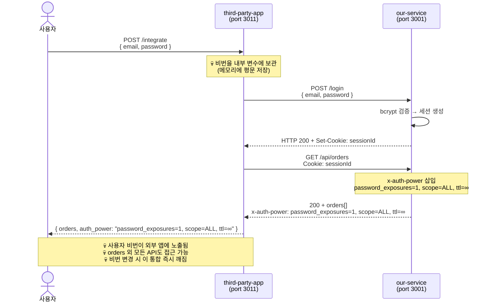
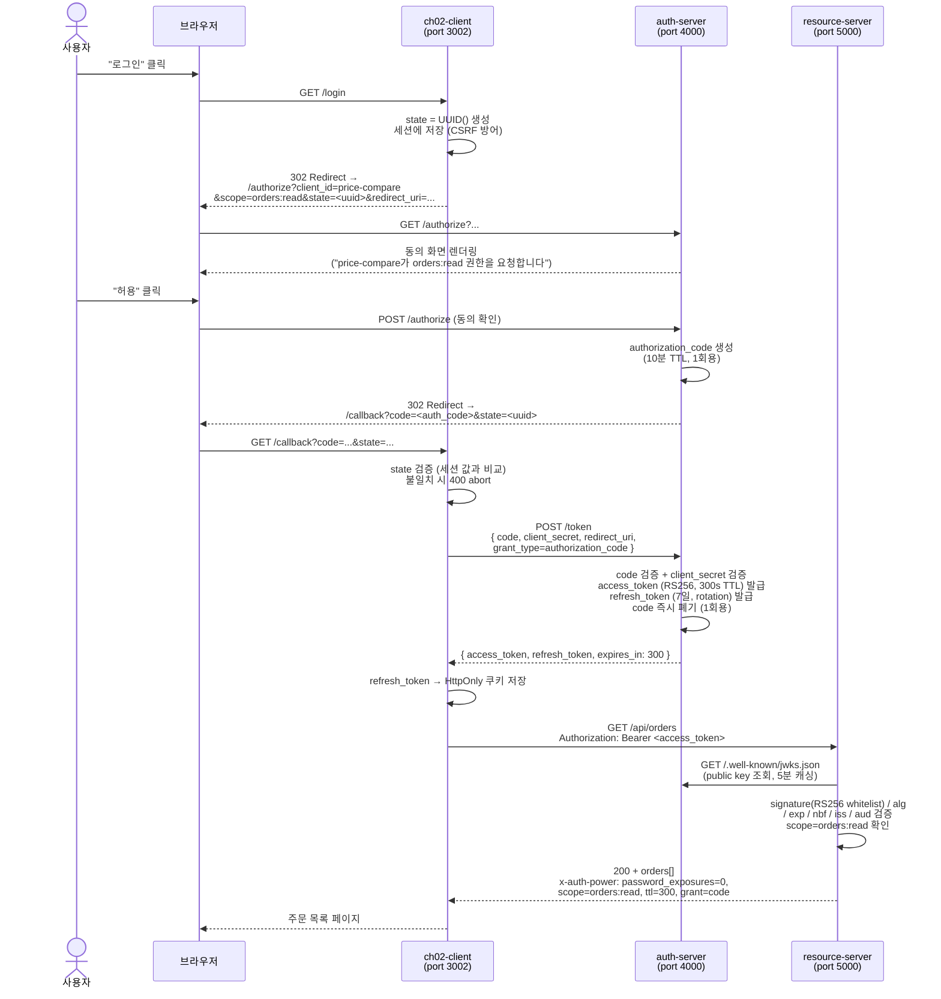
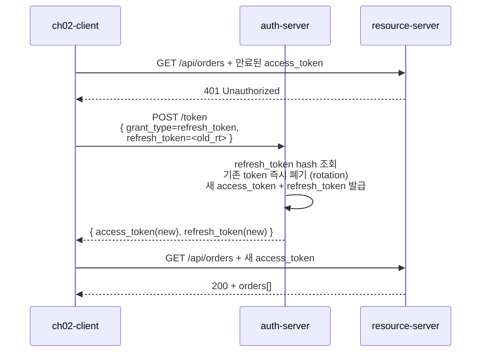
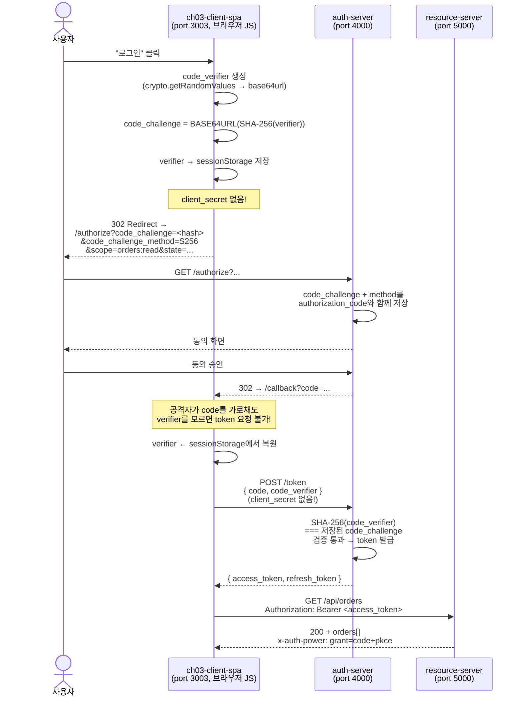
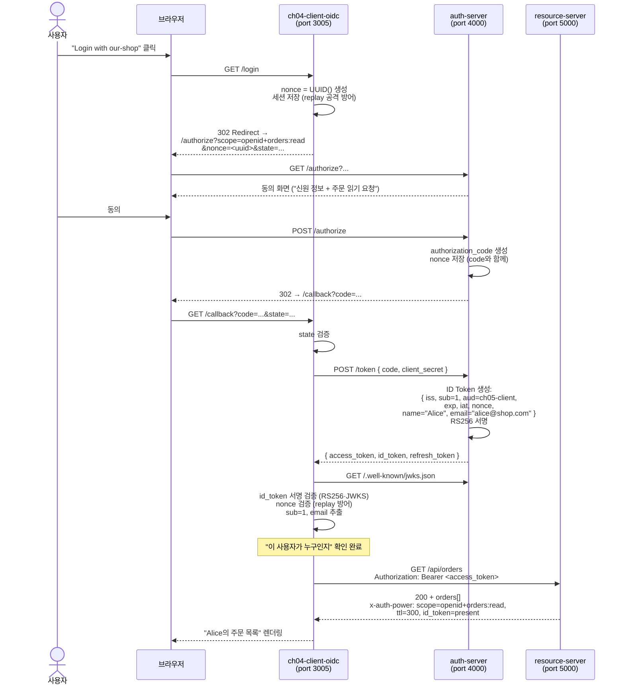
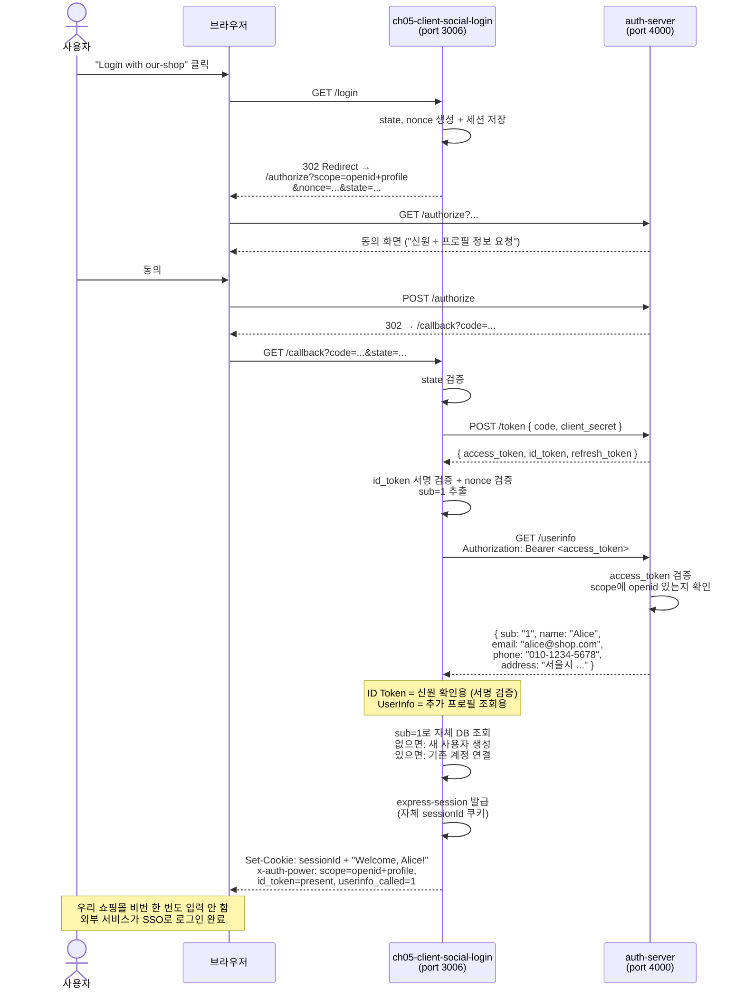

# JWT / OAuth 2.0 / OIDC Lecture Suite — 시나리오 학습 설계서

> **For agentic workers:** 이 spec을 기반으로 `superpowers:writing-plans` 스킬로 구현 플랜을 작성하세요.

---

## Context

`db-with-nestjs` 레포의 네 번째 학습 분기. `feat/db-lecture-suite` → `feat/graphql-lecture-suite` → `feat/oas-lecture-suite`에 이어, **JWT / OAuth 2.0 / OIDC 학습 브랜치**(`feat/jwt-oauth-oidc-lecture-suite`)를 분기한다.

이전 suite들은 단일 프로세스 토글 패턴(`app.module.ts`에서 챕터 하나만 활성화)으로 운영되었다. 본 suite는 **OAuth가 본질적으로 다중 프로세스(Auth Server + Resource Server + Client)** 를 전제하는 도메인이므로, 기존 토글 패턴을 적용하지 않는다. 대신 Auth Server가 챕터마다 점진적으로 진화하고, 챕터별 Client app이 추가되는 조직 전략을 쓴다.

학습 narrative는 **"우리 쇼핑몰이 OAuth Provider 역할을 맡으면서 외부 통합 요구를 받는 과정"** 으로 진행된다. JWT 자체의 통증(세션 vs 토큰 등)은 다루지 않는다. JWT는 권장 구현(짧은 access TTL · 클라이언트 메모리, refresh 긴 TTL · Redis-mock + rotation, RS256 · JWKS)으로 인프라화하고, 학습자는 OAuth/OIDC 통증을 시나리오로 직접 굴린다.

학습을 마치면 다음을 직접 코드로 체험한다:
1. 왜 OAuth가 비번 공유를 대체하는지
2. Authorization Code Flow의 각 주체(User·Browser·Client·Auth Server·Resource Server)가 어떤 메시지를 주고받는지
3. PKCE의 보안적 가치 (code 탈취 방어)
4. OAuth(권한) ↔ OIDC(신원)의 분리
5. 실무 OAuth Provider의 점진적 진화 경로 (Code → PKCE → OIDC → SSO)

**이전 분기 참조**:
- RDB: `feat/db-lecture-suite` / `docs/superpowers/specs/2026-04-20-db-lecture-suite-design.md`
- GraphQL: `feat/graphql-lecture-suite` / `docs/superpowers/specs/2026-04-26-graphql-lecture-suite-design.md`
- OAS: `feat/oas-lecture-suite` / `docs/superpowers/specs/2026-04-27-oas-lecture-suite-design.md`

---

## 핵심 학습 목표

1. **비번 공유의 구조적 한계를 코드로 체감한다** — 서드파티 앱이 사용자 비번을 평문 보관하고 매번 재사용하는 순간, 권한 위임 불가·범위 통제 불가가 추상 개념이 아닌 실제 위험임을 깨닫는다.
2. **OAuth 2.0 Authorization Code Flow의 5단계가 비번 노출 없이 위임을 가능하게 한다** — `state` 검증·code 교환·refresh rotation까지 직접 구현하면서 표준이 존재하는 이유를 이해한다.
3. **client_secret을 보관할 수 없는 환경에서는 PKCE가 code 탈취를 방어한다** — code_verifier/code_challenge 쌍이 authorization code를 가로챈 공격자를 무력화하는 원리를 코드로 확인한다.
4. **access token은 권한 증명이지 신원 증명이 아니다** — OIDC ID Token을 도입하는 순간 "누구를 위한 토큰인가"와 "이 사람이 누구인가"가 다른 질문임을 깨닫는다.
5. **OIDC 풀 흐름 — ID Token + UserInfo로 외부 서비스가 우리 사용자 신원을 안전히 받아 SSO를 구축한다** — 'Login with our-shop' 시나리오로 소셜 로그인의 전 흐름을 직접 작성한다.

---

## 대상 학습자

**전제 지식**:
- NestJS 기본 (Module / Controller / Provider / Guard / Interceptor)
- TypeScript 기본 (인터페이스, 제네릭)
- REST API 개념 (HTTP 메서드, 상태 코드, 헤더, JSON)

**권장 선행**: `feat/db-lecture-suite` 또는 동등한 NestJS REST API 작성 경험.

**JWT 사전 지식 불필요** — 본 suite에서 JWT 권장 구현을 공통 인프라로 제공하므로 처음 접하는 학습자도 진행 가능.

---

## 기술 스택

| 패키지 | 역할 | 챕터 |
|--------|------|------|
| `@nestjs/core`, `@nestjs/common` | NestJS 프레임워크 | 전 챕터 |
| `jose` | JWT 발급·검증, RS256 키페어, JWKS | Ch02~ |
| `node:crypto` | PKCE code_challenge (SHA-256) | Ch03 |
| `ioredis-mock` | Refresh Token 인메모리 저장소 (Redis API 호환) | Ch02~ |
| `@faker-js/faker` | 결정론적 시드 (faker.seed(42)) | 전 챕터 |
| `concurrently` | 챕터별 다중 프로세스 동시 실행 | 전 챕터 |
| **삭제 없음** | — 기존 OAS suite 의존성 유지, 새 앱만 추가 | — |

> **⚠️ jose vs @nestjs/jwt**: `jose`는 JWKS endpoint 지원 및 Web Crypto API 표준 준수가 학습 가치가 높아 선택. `@nestjs/jwt`는 JWKS 직접 지원 없어 Resource Server의 토큰 검증 구현이 비표준화됨.

> **⚠️ ioredis-mock 버전 확인**: writing-plans 단계에서 npm 레지스트리 확인 후 버전 확정. 대안: 단순 `Map<string, RefreshToken>` + `setTimeout` TTL 모사.

---

## 도메인 모델

```typescript
// libs/mock-data/src/domain.ts — 기존 모델 확장 (OAS suite와 공유)

export interface User {
  id: number;
  email: string;
  name: string;
  passwordHash: string;   // Ch01 anti-pattern 시연용
}

export interface Product {
  id: number;
  name: string;
  priceInWon: number;     // Contract Invariant 유지
}

export type OrderStatus = 'PENDING' | 'SHIPPED' | 'DELIVERED' | 'CANCELLED';

export interface Order {
  id: number;
  userId: number;
  productId: number;
  status: OrderStatus;
  createdAt: string;      // ISO 8601
}

// --- OAuth-specific (신규 추가) ---

export interface RegisteredClient {
  clientId: string;
  clientSecret?: string;          // PKCE 전용 client는 undefined
  redirectUris: string[];
  allowedGrantTypes: Array<'authorization_code'>;
  allowedScopes: string[];
  pkceRequired: boolean;
}

export interface AuthorizationCode {
  code: string;
  clientId: string;
  userId: number;
  scope: string;
  redirectUri: string;
  expiresAt: number;
  codeChallenge?: string;         // PKCE (Ch03+)
  codeChallengeMethod?: 'S256';   // PKCE (Ch03+)
  nonce?: string;                 // OIDC (Ch05+)
}

export interface RefreshToken {
  jti: string;
  clientId: string;
  userId?: number;        // PKCE 전용 등 특수 케이스에서 undefined 가능
  scope: string;
  hashedToken: string;    // sha256 해시 — DB엔 원본 저장 안 함
  expiresAt: number;
}
```

---

## 프로젝트 디렉토리 구조

```
db-with-nestjs/  (feat/jwt-oauth-oidc-lecture-suite)
│
├── apps/
│   │
│   ├── ch01-password-sharing/          # 통증: 비번 공유 raw 통합
│   │   ├── our-service/                # NestJS — 자체 username/password 인증 (포트 3001)
│   │   │   └── src/
│   │   │       ├── main.ts
│   │   │       ├── app.module.ts
│   │   │       ├── auth/               # POST /login, GET /api/orders (세션 쿠키)
│   │   │       └── orders/             # GET /api/orders
│   │   └── third-party-app/            # NestJS — 비번 받아 raw 통합 (포트 3011)
│   │       └── src/
│   │           ├── main.ts
│   │           └── integrate/          # POST /integrate (💀 비번 보관 + raw 로그인)
│   │
│   ├── auth-server/                    # Ch02 등장, 챕터마다 진화 (포트 4000)
│   │   └── src/
│   │       ├── main.ts
│   │       ├── app.module.ts
│   │       ├── grants/
│   │       │   ├── authorization-code.service.ts   # Ch02
│   │       │   ├── pkce.service.ts                  # Ch03 추가
│   │       │   └── openid.service.ts                # Ch04 추가 (ID Token)
│   │       ├── authorize/              # GET  /authorize (동의 화면)
│   │       ├── token/                  # POST /token (code → access + refresh)
│   │       ├── jwks/                   # GET  /.well-known/jwks.json
│   │       ├── refresh-store/          # RefreshToken CRUD (ioredis-mock or Map)
│   │       └── userinfo/               # GET  /userinfo (Ch05 추가)
│   │
│   ├── resource-server/                # Ch02 등장 — JWT 검증·scope 검사만 (포트 5000)
│   │   └── src/
│   │       ├── main.ts
│   │       ├── app.module.ts
│   │       ├── common/
│   │       │   ├── jwt-verifier.service.ts          # JWKS 조회 + public key 캐싱
│   │       │   ├── scope.guard.ts                   # scope 검사
│   │       │   └── x-auth-power.interceptor.ts      # 측정 헤더 주입
│   │       ├── orders/                 # GET /api/orders (scope=orders:read)
│   │       ├── products/               # GET /api/products
│   │       └── user-profile/           # GET /api/user/profile (OIDC, Ch04+)
│   │
│   ├── ch02-client-server-side/        # 전통 server-side web app (포트 3002)
│   │   └── src/
│   │       ├── main.ts
│   │       ├── login.controller.ts     # GET /login → auth-server redirect
│   │       ├── callback.controller.ts  # GET /callback — code 수신 + state 검증
│   │       └── oauth.service.ts        # code → token 교환 + refresh 관리
│   │
│   ├── ch03-client-spa/                # PKCE (포트 3003)
│   │   └── src/
│   │       ├── main.ts                 # NestJS static asset serving
│   │       └── public/
│   │           └── index.html          # vanilla JS — verifier/challenge 생성 + PKCE 흐름
│   │
│   ├── ch04-client-oidc/               # OIDC ID Token (포트 3005)
│   │   └── src/
│   │       ├── main.ts
│   │       ├── login.controller.ts     # scope=openid+orders:read 포함
│   │       ├── callback.controller.ts  # ID Token 수신 + 서명 검증 + nonce 확인
│   │       └── oidc.service.ts         # ID Token decode + claims 출력
│   │
│   └── ch05-client-social-login/       # UserInfo + SSO (포트 3006)
│       └── src/
│           ├── main.ts
│           ├── login.controller.ts
│           ├── callback.controller.ts  # ID Token 검증 → UserInfo 호출 → 자체 세션 발급
│           └── social-auth.service.ts  # 사용자 자동 생성/연결 로직
│
├── libs/
│   └── mock-data/                      # faker.seed(42) — 전 챕터 공유
│       └── src/
│           ├── index.ts
│           ├── domain.ts               # 위 TypeScript 인터페이스
│           ├── seed.ts                 # faker.seed(42) — 결정론적
│           ├── store.ts                # 인메모리 배열 (users, products, orders, clients)
│           └── mock-repository.ts     # findOne / findMany
│
├── nest-cli.json                       # 모노레포 — 7개+ 앱 등록
├── package.json
└── tsconfig.json
```

### 포트 할당

| 서비스 | Port | 등장 챕터 |
|--------|------|---------|
| auth-server | 4000 | Ch02~ |
| resource-server | 5000 | Ch02~ |
| ch01 our-service | 3001 | Ch01 |
| ch01 third-party-app | 3011 | Ch01 |
| ch02-client-server-side | 3002 | Ch02 |
| ch03-client-spa | 3003 | Ch03 |
| ch04-client-oidc | 3005 | Ch04 |
| ch05-client-social-login | 3006 | Ch05 |

---

## 공통 학습 보조 장치

### 측정 장치: `x-auth-power` 응답 헤더

Resource Server (`apps/resource-server/src/common/x-auth-power.interceptor.ts`)에 NestJS Interceptor로 주입. AsyncLocalStorage 기반 카운터 (기존 `libs/mock-data/call-counter.ts` 패턴 응용).

**출력 형식**:
```
x-auth-power: password_exposures=N, scope=A+B, ttl=Ns, grant=<type>, refresh=N, id_token=<present|absent>, pkce=<true|false>, userinfo_called=N
```

**챕터별 기대값**:

| Ch | 기대 헤더 | 의미 |
|----|----------|------|
| 01 | `password_exposures=1, scope=ALL, ttl=∞, grant=password` | 비번 1회 노출, 전체 권한, 만료 없음 |
| 02 | `password_exposures=0, scope=orders:read, ttl=300, grant=code, refresh=0` | 비번 0, 최소 권한, 300s TTL |
| 03 | `password_exposures=0, scope=orders:read, ttl=300, grant=code+pkce` | PKCE 추가 |
| 04 | `password_exposures=0, scope=openid+orders:read, ttl=300, id_token=present` | ID Token 첫 등장 |
| 05 | `password_exposures=0, scope=openid+profile, id_token=present, userinfo_called=1` | UserInfo 호출 완료 |

### 결정론적 시드

`faker.seed(42)` — `libs/mock-data/src/seed.ts`. 챕터 변경 시 데이터 변동으로 인한 혼란 방지.

### 챕터 토글 (다중 프로세스)

본 suite는 단일 프로세스 `app.module.ts` 토글 패턴을 쓰지 않는다. `package.json`의 `start:chXX` 스크립트로 챕터별 필요 프로세스를 `concurrently`로 실행:

```json
"start:ch01": "concurrently \"nest start ch01-our-service --watch\" \"nest start ch01-third-party-app --watch\"",
"start:ch02": "concurrently \"nest start auth-server --watch\" \"nest start resource-server --watch\" \"nest start ch02-client-server-side --watch\"",
"start:ch03": "concurrently \"nest start auth-server --watch\" \"nest start resource-server --watch\" \"nest start ch03-client-spa --watch\"",
"start:ch04": "concurrently \"nest start auth-server --watch\" \"nest start resource-server --watch\" \"nest start ch04-client-oidc --watch\"",
"start:ch05": "concurrently \"nest start auth-server --watch\" \"nest start resource-server --watch\" \"nest start ch05-client-social-login --watch\""
```

---

## 챕터 상세 설계

> 각 챕터는 **통증 → 필요 → Best Practice** 서사로 진행된다.
> **흐름** 섹션은 주체(노드)들이 주고받는 메시지를 시퀀스로 명세한다.
> 측정 헤더(`x-auth-power`)는 흐름의 마지막 노드 응답에서 확인한다.

---

### Ch01: 비번 공유 통합의 한계 (`apps/ch01-password-sharing/`)

**통증**: 가격비교 사이트가 우리 쇼핑몰 사용자의 주문 이력을 읽으려 한다. 우리 쇼핑몰은 OAuth를 제공하지 않는다.

**무엇이 필요했는가**: 외부 앱이 사용자 데이터에 접근할 수 있는 어떤 방법이든 필요하다. 가장 단순한 방법은 사용자 비번을 외부 앱에 주는 것이다.

**Best Practice (이 챕터에서 체험할 결론)**: 비번 공유는 (1) 권한 위임 불가 — 비번 하나로 모든 API 접근, (2) 범위 통제 불가 — 주문만 허용할 수 없음, (3) 취소 불가 — 비번 변경 외에 접근 차단 방법 없음, (4) 신뢰 의존 — 외부 앱이 비번을 어떻게 쓰는지 제어 불가. **이 통증이 OAuth의 존재 이유다.**

**주체**:
- `사용자 (User)`: 가격비교 사이트에 자신의 쇼핑몰 계정 비번을 입력하는 사람
- `third-party-app` (port 3011): 가격비교 사이트. 사용자 비번을 받아 our-service에 직접 로그인
- `our-service` (port 3001): 우리 쇼핑몰. username/password 인증 + 세션 쿠키 발급

**흐름**:


**구현 포인트**:
- `our-service`: `POST /login` → 세션 쿠키. `GET /api/orders` (쿠키 필요). **Ch01 전용 `x-auth-power` interceptor** — `resource-server`는 Ch02에 등장하므로 이 챕터 한정으로 `our-service`에 직접 주입.
- `third-party-app`: `POST /integrate` — 비번 수신 → our-service 로그인 → our-service 응답의 `x-auth-power` 값을 응답 body에 포함.
- **의도적 안티패턴 주석**:
  ```typescript
  // 💀 ANTI-PATTERN: 사용자 비번이 외부 앱 메모리에 평문 보관됨
  // 💀 ANTI-PATTERN: scope 제한 없음 — 비번 하나로 모든 API 접근 가능
  // 💀 ANTI-PATTERN: 비번 변경 시 이 통합은 즉시 깨짐
  ```

**시연**:
```bash
pnpm start:ch01
curl -s -X POST localhost:3011/integrate \
  -H "Content-Type: application/json" \
  -d '{"email":"alice@shop.com","password":"alice123"}' | jq .
# { "orders": [...], "auth_power": "password_exposures=1, scope=ALL, ttl=∞, grant=password" }
```

---

### Ch02: OAuth 2.0 Authorization Code Flow (`apps/auth-server/` + `apps/resource-server/` + `apps/ch02-client-server-side/` 첫 등장)

**통증 (Ch01에서 이어짐)**: 비번 공유는 권한 위임·범위 통제·취소가 불가능하다. 우리 쇼핑몰이 직접 외부 앱에 "주문 읽기"만 허용하고 나중에 취소할 수 있는 방법이 없다.

**무엇이 필요했는가**: 사용자가 비번을 노출하지 않고도 외부 앱에 특정 권한만 위임할 수 있는 표준 프로토콜. 외부 앱은 client_secret을 서버에 안전하게 보관 가능한 server-side web app이다.

**Best Practice**: OAuth 2.0 Authorization Code Flow. 사용자는 Auth Server에서 직접 동의(consent)하고 authorization code만 외부 앱에 전달한다. 외부 앱은 code + client_secret을 Auth Server에 제시해 access token을 받는다. Resource Server는 Auth Server의 public key(JWKS)로 token을 검증하므로 Auth Server를 매 요청마다 호출하지 않는다.

**주체**:
- `사용자 (User)`: 브라우저에서 동의 화면을 보고 권한을 승인하는 사람
- `브라우저 (Browser)`: 사용자의 User-Agent. 리다이렉트를 수행하는 매개체
- `ch02-client-server-side` (port 3002): 가격비교 사이트(server-side web app). client_secret 보유
- `auth-server` (port 4000): 우리 쇼핑몰 OAuth Provider. 토큰 발급·JWKS 제공
- `resource-server` (port 5000): 우리 쇼핑몰 API. JWT 검증만 수행, Auth Server 실시간 호출 없음

**흐름**:


**Refresh Token Rotation 흐름** (access token 만료 후):


**구현 포인트**:
- `auth-server`: RS256 keypair 생성(시작 시) + `/.well-known/jwks.json` (kid 포함). `/authorize` 동의 화면. `/token` code·client_secret 검증. refresh_token: hashed(sha256) + ioredis-mock 저장 + rotation.
- `resource-server`: JWKS 5분 캐싱. JWT 검증 (alg whitelist = RS256만). ScopeGuard. `x-auth-power` interceptor.
- `ch02-client`: state UUID 생성·검증. `/callback` code→token 교환. refresh_token HttpOnly 쿠키 보관.

**시연**:
```bash
pnpm start:ch02
# 브라우저: localhost:3002/login → 동의 → 콜백
curl -i localhost:5000/api/orders -H "Authorization: Bearer $AT"
# x-auth-power: password_exposures=0, scope=orders:read, ttl=300, grant=code, refresh=0
```

---

### Ch03: PKCE (`apps/ch03-client-spa/` + `apps/auth-server/` 진화)

**통증 (Ch02에서 이어짐)**: Ch02의 client는 server-side였다. 하지만 SPA(브라우저 앱)나 모바일 앱은 client_secret을 소스코드·번들에 넣으면 누구나 추출 가능하다. client_secret 없이 Authorization Code Flow를 쓰면, 공격자가 code를 가로채 `/token`을 직접 호출할 수 있다.

**무엇이 필요했는가**: client_secret을 두지 않으면서도 "이 token 요청이 정당한 code 수령자의 것"임을 증명하는 방법.

**Best Practice**: PKCE (Proof Key for Code Exchange). client가 code 요청 전 `code_verifier`(랜덤 문자열)를 생성하고, 그 SHA-256 해시인 `code_challenge`를 `/authorize`에 포함시킨다. 공격자가 code를 가로채더라도 `code_verifier`를 모르면 `/token`을 완성할 수 없다.

**주체**:
- `사용자 (User)`: 브라우저에서 동의하는 사람
- `ch03-client-spa` (port 3003, 브라우저 JS): SPA. client_secret 없음. verifier/challenge를 직접 생성
- `auth-server` (port 4000): code_challenge 저장·검증 로직 추가됨
- `resource-server` (port 5000): 변경 없음 — token 검증 로직 동일

**흐름**:


**구현 포인트**:
- `auth-server 진화`: `/authorize`에서 `code_challenge` + `code_challenge_method` 수신 → code 저장 시 함께 보관. `/token`에서 `code_verifier` 수신 → `node:crypto.createHash('sha256')` 으로 검증. client_secret 없어도 통과.
- `ch03-client-spa`: NestJS `ServeStaticModule`로 `public/index.html` serving. index.html vanilla JS에서 Web Crypto API (`SubtleCrypto`) 사용. code_verifier를 `sessionStorage`에 보관 (localStorage 아님 — XSS 탭 격리).

**시연**:
```bash
pnpm start:ch03
# 브라우저: localhost:3003 → 로그인 클릭
# DevTools > Application > sessionStorage: code_verifier 값 확인
# DevTools > Network > /token 요청: code_verifier 있음, client_secret 없음 확인
# x-auth-power: grant=code+pkce, password_exposures=0
```

---

### Ch04: OIDC ID Token (`apps/ch04-client-oidc/` + `apps/auth-server/` 진화)

**통증 (Ch02에서 이어짐)**: 가계부 앱이 'Login with our-shop'을 구현하려 한다. Ch02 흐름으로 access_token을 받았다. 그런데 access_token은 "orders:read 권한이 있다"는 증명이지, "이 토큰이 누구의 것인가"를 말해주지 않는다. access_token payload에서 `sub` 클레임으로 userId를 읽을 수 있지만, 이는 비표준 의존이고 token 형식이 바뀌면 깨진다.

**무엇이 필요했는가**: 사용자 신원 정보를 표준화된 형식으로, 서명이 검증 가능하게 전달하는 방법.

**Best Practice**: OIDC(OpenID Connect). `scope=openid`를 포함해 `/authorize`를 요청하면, Auth Server는 access_token과 별개로 **ID Token**(JWT)을 발급한다. ID Token은 `sub`, `email`, `name`, `iss`, `aud`, `nonce` 등 신원 클레임을 담고, 같은 RS256 키로 서명된다. client는 JWKS로 서명을 검증한다.

**주체**:
- `사용자 (User)`: 동의하는 사람
- `브라우저 (Browser)`: 리다이렉트 매개체
- `ch04-client-oidc` (port 3005): 가계부 앱. ID Token으로 사용자 신원 확인
- `auth-server` (port 4000): `scope=openid` 시 ID Token 발급 로직 추가됨
- `resource-server` (port 5000): 변경 없음. access_token payload에 `sub` 있으면 통과

**흐름**:


**구현 포인트**:
- `auth-server 진화`: `/token`에서 `scope`에 `openid` 포함 시 ID Token 발급. ID Token claims: `iss`, `sub`, `aud`, `exp`, `iat`, `nonce`, `name`, `email`. 동일 RS256 키 사용 (access_token과 같은 JWKS로 검증 가능).
- `ch05-client-oidc`: nonce 생성·세션 저장. 콜백에서 `id_token` jose `jwtVerify`로 검증. nonce 불일치 시 401.

**시연**:
```bash
pnpm start:ch04
# 브라우저: localhost:3005/login → 동의 → 콜백
# 서버 콘솔: ID Token verified: { sub: '1', email: 'alice@shop.com', name: 'Alice' }
# x-auth-power: scope=openid+orders:read, ttl=300, id_token=present
```

---

### Ch05: UserInfo + SSO 통합 (`apps/ch05-client-social-login/` + `apps/auth-server/` 진화)

**통증 (Ch05에서 이어짐)**: ID Token에는 핵심 식별 정보(`sub`, `email`, `name`)만 담긴다. JWT 크기를 작게 유지하기 위해 주소·전화·추가 프로필은 ID Token에 넣지 않는다. 또한 client는 ID Token으로 신원을 확인했지만, 자체 서비스에서 이 사용자를 어떻게 관리할지(자동 회원가입·계정 연결)는 아직 해결되지 않았다.

**무엇이 필요했는가**: (1) ID Token 이후 추가 프로필 데이터를 가져오는 표준 방법. (2) 외부 서비스가 우리 사용자로 자체 계정을 자동 생성·연결하는 SSO 완성 패턴.

**Best Practice**: OIDC UserInfo 엔드포인트. `GET /userinfo` + access_token으로 추가 프로필 수신. client는 ID Token 검증 → `sub` 추출 → UserInfo 호출 → 자체 DB 조회 → 없으면 생성(계정 연결) → 자체 세션 발급. **이것이 'Login with Google/GitHub'의 내부 동작이다.**

**주체**:
- `사용자 (User)`: 'Login with our-shop' 버튼을 클릭하는 사람
- `브라우저 (Browser)`: 리다이렉트 매개체
- `ch05-client-social-login` (port 3006): SSO를 구현하는 외부 서비스. 자체 사용자 DB 보유
- `auth-server` (port 4000): `/userinfo` 엔드포인트 추가됨
- `resource-server` (port 5000): 이 챕터에서는 직접 사용 안 함 (SSO 흐름에 집중)

**흐름**:


**구현 포인트**:
- `auth-server 진화`: `GET /userinfo` — Bearer token 검증 + `openid` scope 확인 + scope에 따라 필드 제한 반환 (`profile` scope → name/phone/address, `email` scope → email).
- `ch06-client-social-login`: ID Token 검증 → UserInfo 호출 → `sub` 기반 upsert → `express-session` 인메모리 발급.
- `x-auth-power` 헤더: Ch06에서는 `/userinfo` 응답 헤더에 `userinfo_called=1` 포함 (resource-server 없이 auth-server에서 직접 주입).

**시연**:
```bash
pnpm start:ch05
# 브라우저: localhost:3006
# "Login with our-shop" 클릭 → 동의 → 자동 회원가입 → "Welcome, Alice!"
# Network: GET /userinfo 200 확인
# x-auth-power: scope=openid+profile, id_token=present, userinfo_called=1
```

---

## 챕터 간 비교 가이드

| Ch | password_exposures | scope | ttl | grant | id_token | 통증 → 해결 |
|----|-------------------|-------|-----|-------|----------|------------|
| 01 | **1** ⚠️ | ALL ⚠️ | ∞ ⚠️ | password ⚠️ | absent | (anti-pattern 체험) |
| 02 | 0 ✅ | orders:read | 300s | code | absent | 비번 공유 → OAuth 위임 |
| 03 | 0 | orders:read | 300s | code+pkce | absent | secret 노출 → PKCE |
| 04 | 0 | openid+orders:read | 300s | code | **present** ✅ | 권한 ≠ 신원 → ID Token |
| 05 | 0 | openid+profile | 300s | code | present + userinfo | ID Token 부족 → UserInfo + SSO |

---

## 시연 순서 (README 기반)

```bash
# 1. 설치
pnpm install

# 2. 챕터 선택 후 실행
pnpm start:ch01   # anti-pattern 체험
pnpm start:ch02   # Authorization Code Flow
pnpm start:ch03   # PKCE
pnpm start:ch04   # OIDC ID Token
pnpm start:ch05   # UserInfo + SSO

# 3. 각 챕터 시연 — curl 또는 브라우저
curl -i localhost:5000/api/orders -H "Authorization: Bearer $AT"
# Response header: x-auth-power: <챕터별 기대값>
```

---

## Auth Server 진화 요약 (보안 구현 체크리스트 기반)

강의 노트의 "토큰 검증 필수 체크리스트"를 auth-server 구현에 반영:

| 항목 | 구현 위치 | 챕터 |
|-----|---------|------|
| 서명 알고리즘 화이트리스트 (RS256만 허용) | resource-server jwt-verifier | Ch02~ |
| iss 검증 (`http://localhost:4000`) | resource-server jwt-verifier | Ch02~ |
| aud 검증 (client_id) | resource-server jwt-verifier | Ch02~ |
| exp / nbf / iat 검증 | resource-server jwt-verifier | Ch02~ |
| JWKS kid 기반 public key 선택 | resource-server jwt-verifier | Ch02~ |
| Refresh Token hashed 저장 | auth-server refresh-store | Ch02~ |
| Refresh Token rotation (폐기 + 재발급) | auth-server token controller | Ch02~ |
| state 파라미터 CSRF 방어 | ch02~ch05 client callback | Ch02~ |
| redirect_uri 문자 단위 검증 | auth-server authorize | Ch02~ |
| nonce replay 방어 | auth-server token (openid) | Ch04~ |
| PKCE code_challenge 검증 (S256) | auth-server grants/pkce | Ch03~ |

---

## 위험 요소 + writing-plans 단계 검증 항목

1. **`jose` API 선택**: `jose`의 `generateKeyPair`, `SignJWT`, `jwtVerify`, `createLocalJWKSet`, `createRemoteJWKSet` API 정확한 사용법 — writing-plans에서 `context7` 또는 공식 문서 확인.
2. **ioredis-mock 패키지명/버전**: `ioredis-mock`으로 npm 검색 후 최신 안정 버전 확인. 대안: 단순 `Map` + `setTimeout` TTL.
3. **nest-cli.json 앱 등록**: `ch01-our-service`, `ch01-third-party-app` 등 중첩 폴더 구조 앱 등록 방식 — entryFile 경로 정확성 필요.
4. **concurrently 색상 구분**: 8개 프로세스가 동시 실행 시 로그 구분 — `--prefix-colors` 설정.
5. **Ch03 Web Crypto API**: NestJS 실행 환경(Node.js)에서 `SubtleCrypto` 사용 가능 여부 확인. 대안: `node:crypto` `createHash('sha256')`.

---

## Verification (구현 완료 시 확인 항목)

- [ ] `pnpm install` exit code 0
- [ ] `pnpm start:ch01` → `curl localhost:3011/integrate ...` → `x-auth-power: password_exposures=1, scope=ALL` 확인
- [ ] `pnpm start:ch02` → 브라우저 OAuth 흐름 완주 → `x-auth-power: password_exposures=0, scope=orders:read` 확인
- [ ] `pnpm start:ch03` → DevTools에서 `code_verifier` sessionStorage 확인, `/token`에 `client_secret` 없음 확인
- [ ] `pnpm start:ch04` → ID Token 서명 검증 통과 + `sub`, `email` 콘솔 출력
- [ ] `pnpm start:ch05` → UserInfo 호출 성공 + `userinfo_called=1` 확인
- [ ] 모든 챕터에서 `password_exposures=0` (Ch01 제외)
- [ ] JWKS public key 캐싱 확인 (auth-server 재시작 없이 resource-server가 키 재사용)
- [ ] Refresh Token rotation: 동일 refresh token 2회 사용 시 2번째는 401
